## 🔗 빠른 링크
- 📑 기획서(피그마 슬라이드): https://www.figma.com/design/frdj3RVv4YaQB0MXHrSj0V/2%EC%B0%A8-%ED%94%84%EB%A1%9C%EC%A0%9D%ED%8A%B8_design?node-id=1-3&t=bPGnOCQ79In0j33j-1

- 🎨 디자인 원본(피그마): https://www.figma.com/slides/HtA3UUvRiurlZiIL4hyUQ3/2%EC%B0%A8-%ED%94%84%EB%A1%9C%EC%A0%9D%ED%8A%B8?node-id=53-34&t=oAqugnKRPfT7apW6-1

---

# HanaTour 사이트 리뉴얼 프로젝트

> 기존 하나투어 웹사이트를 사용자 중심으로 디자인하고, **프론트엔드 + 백엔드**가 연동되는 **반응형 웹**으로 구현한 프로젝트입니다.

---

## 📑 목차
- [프로젝트 개요](#프로젝트-개요)
- [기술 스택](#기술-스택)
- [폴더 구조](#폴더-구조)
- [주요 기능 & 페이지 구성](#주요-기능--페이지-구성)
- [역할 분담](#역할-분담)
- [개발 환경 & 실행 방법](#개발-환경--실행-방법)
- [배포 환경](#배포-환경)
- [추가 계획 & 확장 아이디어](#추가-계획--확장-아이디어)
- [크레딧 & 버전](#크레딧--버전)

---

## 1. 프로젝트 개요
HanaTour 기존 사이트는 반응형 설계와 동적 요소가 부족했어요.  
그래서 **UX 중심 리뉴얼**, **일관된 디자인 시스템**, **반응형 레이아웃(모바일/태블릿 대응)**, **현대 웹 기술 도입(HTML5, CSS3, JS, PHP, MySQL 등)**을 목표로 프로젝트를 진행했습니다.  
디자인은 **Figma**로, 개발과 테스트는 **VS Code + XAMPP** 환경에서 이루어졌습니다.

---
### 1.1 👥 팀원
| 이름 | 역할 | 주요 담당 | GitHub | 연락 |
| --- | --- | --- | --- | --- |
| 조아랑 | 팀장 · BE 리드 | 	Weather API<br>Section Slide<br>Login Page<br>서브페이지 DB 연동<br>백엔드 구축 | [@likerang](https://github.com/likerang) | like_rang@naver.com |
| 장원석 | FE 리드 · BE | Main Section<br>반응형<br>Event Page<br>서브페이지 DB 연동<br>백엔드 구축 | [@timcho19](https://github.com/timcho19) | timcho4589@gmail.com |
| 정진욱 | FE | 	Footer<br>Section Slide<br>FAQ Page | [@jiwoo-park](https://github.com/jiwoo-park) | jiwoo@example.com |


---
### 1.2 🗓️ 마일스톤


#### 1-4주차 — 기획/설계
- [ ] 리뉴얼 사이트 선정 및 분석
- [ ] 벤치마킹 사이트 조사
- [ ] 리뉴얼 방향 설정
- [ ] 사이트맵 구조도 제작
- [ ] 웹사이트 스케치/스토리보드 작성
- [ ] 메인 비주얼/컨셉 작업
- [ ] 스타일 가이드 및 UI 컴포넌트 제작

#### 5-8주차 — 핵심 기능
- [ ] 메인 페이지 및 서브페이지 화면 구성
- [ ] 로그인 페이지 및 인증 기능 구현
- [ ] DB 연동 및 CRUD 기능 개발
- [ ] 이미지 업로드 및 썸네일 처리

#### 9주차 — 품질 점검 및 배포 준비
- [ ] SEO, OG 태그 설정 및 사이트맵 작성
- [ ] 성능 최적화 및 코드 스플리팅 적용
- [ ] 접근성 점검(키보드 포커스/명도 대비 등)
- [ ] 닷홈으로 배포
- [ ] README, 시연자료(스크린샷·GIF) 정리

```mermaid
gantt
    title 하나투어 간트 차트
    dateFormat  2025-07-14
    excludes    weekends


    section 기획/설계
    자료조사·방향설정           :a1, 2025-05-12, 3d
    스케치/스토리보드           :a2, after a1, 3d
    1차 발표자료                   :a3, after a2, 2d
    스타일 가이드              :a4, after a3, 3d
    Figma 디자인(메인)        :a5, after a4, 18d
    Figma 디자인(서브)        :a6, 2025-06-01, 11d
    2차 발표자료              :a7, after a6, 1d


    section 구현(핵심)
    컨벤션 구축 / 파트 분배     :b1, 2025-06-17, 1d
    변수, common 작성          :b2, after b1, 1d
    파트별 코딩 (메인)          :b3, after b2, 14d
    파트별 코딩 (서브)          :b4, 2025-06-28, 6d
    DB 생성 / 데이터 연결       :b5, 2025-07-02, 7d



    section 품질
    SEO/OG·성능·접근성         :c1, 2025-07-11, 2d
    테스트(E2E)·에러관측       :c2, 2025-07-11, 2d

    section 릴리스
    문서화·시연자료 :d1, 2025-07-09, 2d
```




---

### 1.3 주요 기능 & 페이지 구성
- **메인 페이지**
  - 헤더, 메인 배너 (장원석 담당)
  - 상품 슬라이드, 푸터 (정진욱 담당)
  - Shorts/Youtube 슬라이드, 날씨 API 통합 (조아랑 담당)
- **FAQ 페이지**
  - 검색창, 카테고리 필터 (정진욱 담당)
- **로그인/회원가입 페이지**
  - 비회원 조회 기능, DB 연동 (조아랑 담당)
- **이벤트 & 관리자 페이지**
  - 이벤트 콘텐츠 및 관리자 기능 (장원석 담당)

---


## 2. 기술 스택
- **Design**: Figma  
- **Frontend**: HTML5, CSS3, JavaScript, jQuery  
- **Backend**: PHP, MySQL  
- **개발 도구**: VS Code, XAMPP  

---

## 3. 데이터 흐름

```mermaid
sequenceDiagram
    actor User as 사용자
    participant FE as Frontend<br/>(HTML/CSS/JS)
    participant BE as PHP Backend
    participant DB as MySQL DB
    participant API as External APIs
    participant File as File System

    Note over User, File: 메인페이지 데이터 흐름
    User->>+FE: 메인페이지 접속
    FE->>+BE: 페이지 요청 (index.php)
    BE->>+DB: 상품/이벤트 데이터 조회
    DB-->>-BE: 상품 목록 반환
    BE->>+API: 날씨 API 호출
    API-->>-BE: 날씨 정보
    BE->>+File: 이미지 에셋 로드
    File-->>-BE: 이미지 파일
    BE-->>-FE: 렌더링된 HTML + 데이터
    FE-->>-User: 완성된 페이지 표시

    Note over User, File: 로그인/회원가입 흐름
    User->>+FE: 로그인 정보 입력
    FE->>+BE: 로그인 요청 (login.php)
    BE->>+DB: 사용자 인증 쿼리
    DB-->>-BE: 인증 결과
    alt 로그인 성공
        BE->>BE: 세션 생성
        BE-->>FE: 성공 응답 + 리다이렉트
        FE-->>User: 메인페이지로 이동
    else 로그인 실패
        BE-->>FE: 에러 메시지
        FE-->>User: 오류 표시
    end
```



---

## 4. 폴더 구조
```
/
├─ .vscode/
├─ css/              # 스타일 시트
├─ image/            # 이미지 에셋
├─ inc/              # 공통 include 모듈
├─ js/               # JavaScript 코드
├─ json/             # JSON 데이터
├─ sql/              # DB 스크립트
├─ uploads/          # 업로드 파일
├─ view/             # 뷰 템플릿
├─ *.php             # 주요 페이지 (index.php, login.php 등)
└─ readMe.md         # 기존 README
```

---

## 5. 아키텍쳐 
```mermaid
%% ===== HanaTour Site Renewal Project Data Flow =====
flowchart TD

%% 1) 노드 모양 레전드
subgraph Legend[Legend: Node Shapes]
  direction LR
  L1[Process / Rect]:::muted
  L2(Rounded):::muted
  L3{Decision}:::muted
  L4((Circle)):::muted
  L5[[Service/API]]:::muted
  L6[/I/O Data/]:::muted
  L7[(Database)]:::muted
end

%% 2) 클라이언트 레이어
subgraph Client[Client Layer - Frontend]
  direction TB
  C0([User Access]):::start
  C1[Main Page<br/>index.php]
  C2[Login Page<br/>login.php]
  C3[FAQ Page]
  C4[Event Page]
  C5[Admin Page]
  C6{User Type?}
  C7[Member Dashboard]
  C8[Non-Member View]
end

%% 3) 프레젠테이션 레이어
subgraph Presentation[Presentation Layer]
  direction TB
  P1[Header Component<br/>(장원석)]
  P2[Main Banner<br/>(장원석)]
  P3[Product Slide<br/>(정진욱)]
  P4[YouTube/Shorts Slide<br/>(조아랑)]
  P5[Weather Section<br/>(조아랑)]
  P6[Footer<br/>(정진욱)]
  P7[Search & Filter<br/>(정진욱)]
end

%% 4) 비즈니스 로직 레이어
subgraph BusinessLogic[Business Logic Layer - PHP]
  direction TB
  B1[[Login Service]]:::service
  B2[[User Management]]:::service
  B3[[Event Management]]:::service
  B4[[FAQ Service]]:::service
  B5[[Search Service]]:::service
  B6[[Weather API Service]]:::service
  B7[[Product Service]]:::service
  B8[[Admin Service]]:::service
end

%% 5) 데이터 레이어
subgraph DataLayer[Data Layer]
  direction TB
  D1[(MySQL Database)]:::db
  D2[(User Table)]:::db
  D3[(Event Table)]:::db
  D4[(FAQ Table)]:::db
  D5[(Product Table)]:::db
  D6[(Admin Table)]:::db
end

%% 6) 외부 서비스
subgraph External[External Services]
  direction TB
  E1[[Weather API]]:::external
  E2[[YouTube API]]:::external
  E3[/Image Upload/<br/>uploads/]:::storage
  E4[/JSON Data/<br/>json/]:::storage
end

%% 7) 호스팅 환경
subgraph Hosting[Hosting Environment]
  direction TB
  H1[XAMPP Local<br/>localhost]:::hosting
  H2[Dothome Hosting<br/>Production]:::hosting
end

%% 메인 플로우
C0 --> C1
C1 --> C6
C6 -- Member --> C2
C6 -- Non-Member --> C8
C2 --> B1
B1 --> D2
B1 --> C7

%% 페이지별 플로우
C1 --> P1
C1 --> P2
C1 --> P3
C1 --> P4
C1 --> P5
C1 --> P6

%% FAQ 플로우
C3 --> P7
P7 --> B4
B4 --> D4
P7 --> B5
B5 --> D4

%% 이벤트 플로우
C4 --> B3
B3 --> D3
C4 --> E3

%% 관리자 플로우
C5 --> B8
B8 --> D6
B8 --> D1

%% 외부 API 연동
P5 --> B6
B6 --> E1
P4 --> E2

%% 데이터베이스 관계
D1 --> D2
D1 --> D3
D1 --> D4
D1 --> D5
D1 --> D6

%% 서비스 연결
B1 --> D2
B3 --> D3
B4 --> D4
B5 --> D4
B7 --> D5
B8 --> D6

%% 호스팅 연결
H1 -.-> C1
H2 -.-> C1

%% 스타일 클래스 정의
classDef start fill:#e0f2fe,stroke:#0284c7,color:#075985;
classDef db fill:#fef9c3,stroke:#f59e0b,color:#92400e;
classDef service fill:#e9d5ff,stroke:#7c3aed,color:#4c1d95;
classDef external fill:#dcfce7,stroke:#16a34a,color:#166534;
classDef storage fill:#fef3c7,stroke:#d97706,color:#92400e;
classDef hosting fill:#fee2e2,stroke:#ef4444,color:#991b1b;
classDef muted fill:#f1f5f9,stroke:#94a3b8,color:#475569;

%% 핵심 경로 강조
class B1,B2,B3,D1 service
class E1,E2 external
class E3,E4 storage
class H1,H2 hosting

%% 특정 노드 강조
style C6 fill:#fbbf24,stroke:#f59e0b,color:#92400e
style D1 fill:#fbbf24,stroke:#f59e0b,color:#92400e
```

---

## 6. 개발 환경 & 실행 방법
1. **클론**
   ```bash
   git clone https://github.com/likerang/Site_Renewal_Project_HanaTour.git
   cd Site_Renewal_Project_HanaTour
   ```
2. **XAMPP 연결**
   - 프로젝트 폴더를 `htdocs/` 안에 복사
   - **MySQL** 실행, DB 세팅 (`sql/` 폴더 참고)

3. **웹 브라우저로 접근**
   - 로컬: `http://localhost/Site_Renewal_Project_HanaTour/`
   - 배포: `http://dkfkd.dothome.co.kr/Site_Renewal_Project_HanaTour/`

4. **VS Code Live Server**
   - HTML/CSS/JS 테스트 시 사용 가능

---

## 7. 배포 환경
- **호스팅**: Dothome  
- **배포 URL**: [http://dkfkd.dothome.co.kr/Site_Renewal_Project_HanaTour/](http://dkfkd.dothome.co.kr/Site_Renewal_Project_HanaTour/)  
- **배포 방식**: FTP 업로드 (FileZilla 등)

---

## 8. 향후 개선 사항
- 반응형 개선: 모바일/태블릿 최적화 강화
- 맞춤형 콘텐츠 강화
- 접근성 향상: ARIA, 키보드 내비게이션, 명도 대비 체크

---

## 9. 제작 후기
이번 프로젝트를 통해 PHP와 데이터베이스 연동을 활용한 동적 웹사이트 구현을 성공적으로 완료하였으며, 팀원들과의 원활한 협업 경험도 쌓을 수 있었습니다.
전반적으로 기획부터 개발까지 웹 개발의 전 과정을 경험하며 많은 성장을 이룬 의미있는 프로젝트였습니다.
---

## 10. 미리보기
### 11.1 미리보기
[](https://www.figma.com/design/frdj3RVv4YaQB0MXHrSj0V/2%EC%B0%A8-%ED%94%84%EB%A1%9C%EC%A0%9D%ED%8A%B8_design?node-id=1-3&t=bPGnOCQ79In0j33j-1 "피그마 슬라이드로 이동")
[](https://www.figma.com/slides/HtA3UUvRiurlZiIL4hyUQ3/2%EC%B0%A8-%ED%94%84%EB%A1%9C%EC%A0%9D%ED%8A%B8?node-id=53-34&t=oAqugnKRPfT7apW6-1 "피그마 디자인으로 이동")


## 10.1 크레딧 & 버전
- 디자인: Figma  
- 개발: 조아랑, 정진욱, 장원석  
- 작업 기간: *2025-05-12 ~ 2025-07-14*
